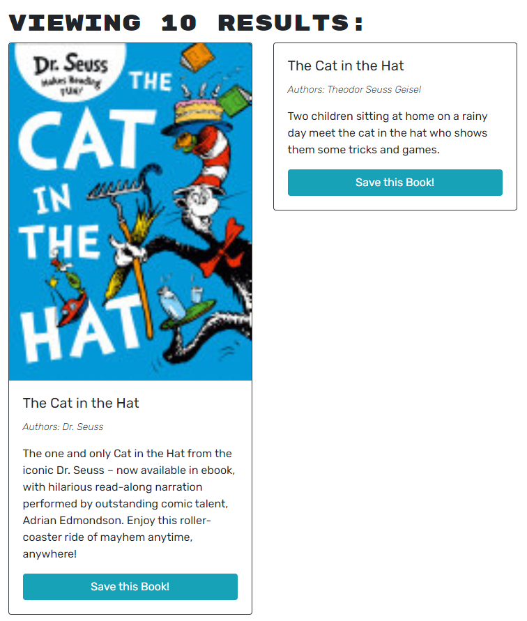

# BookScout

https://bookscout.onrender.com

 

## Description
The reason for this project was to make a platform where users could look up in books and save them to their account. This project was most definitely not easy by any means. Along the way I learned the following:
*Making sure information is being destructured. After 2 tutor sessions reviewing similar error when loggin in or singing user up the chrome console would spit out error stating that there were issued with addUser however everything on the backend looked good. Turns out I needed to wrap my data in "{}" to make sure it was reading information properly. After that fix (suggested by our teacher Jay) this cleared up the issue and allowed to create user and log in. 

## Table of Contents
-[Descriptions](#Descriptions)
-[Installation](#Installation)
-[Usage](#Usage)
-[Credits](#Credits)
-[Tests](#Tests)
-[License](#License)
-[Questions](##Questions)

## Installation
In order to install this project you will have to clone the repository: 
    1. Create a place where you will want to store all this information 
    2. Once there open GitBash
    3. Clone this repository into the file you will have this stored in
            enter following: git@github.com:juanthtgotaway/BookScout.git
    4. Press enter to create your local clone

## Usage
This is used to save books!

## Credits
Major shout outs to my tutors that helped deploy this app and allow it to work: 
* Rene Trevino
* Jaytee Padilla
* Sangeetha Kaliaperumal
* Jay M (Prof.)

## Tests
N/A
## License
MIT

## Questions
If you have any questions or concerns feel free to reach out via the following:
GitHub:[juanthtgotaway](https://github.com/juanthtgotaway)